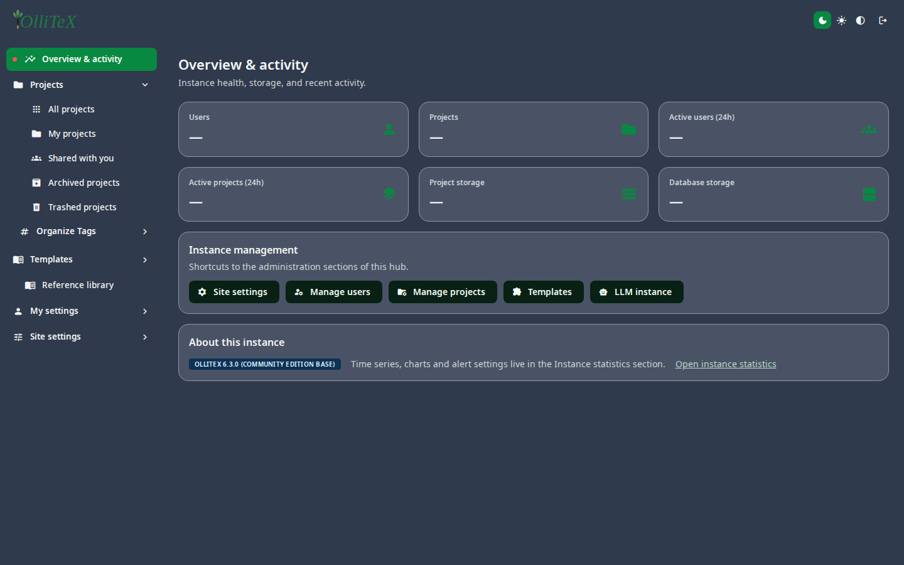

# Admin overview

Goal: understand the admin surface and where each control lives.

Anyone with the site-administrator role sees the **Administration** section
on the hub, plus the full **Site settings** tree. Deep links are the
canonical form: `/admin-settings/<leaf-id>` (the old `/hub#/…` hash form
still resolves via redirects).

## The tree (current)

| Section | Leaves (deep link) | What it covers |
|---|---|---|
| **Overview & activity** | `/admin-settings/overview` | trimmed KPI page: activity, quick links |
| **Users** | `…overview` tree → [Users](02-users.md) | create / suspend / purge |
| **Projects** | /admin-settings tree → [Projects](03-projects.md) | inspect / share / trash / purge |
| **Site settings → General** | `site.*` (sign-up, system messages, editor controls) | the day-to-day site knobs (see [04-site-settings.md](04-site-settings.md)) |
| **Site settings → Integrations** | `site.integrations.*` — Zotero, Mendeley, **WakaTime**, External URLs, **SSO · Providers (multi)**, SSO · SAML (legacy), SSO · OIDC (legacy), SSO · LDAP (legacy) | identity + connectors + time tracking |
| **Site settings → Services** | `site.services.*` — Email/SMTP, Services, Branding, **Grammar (LanguageTool)** | outbound e-mail + language tools |
| **Site settings → Storage** | `site.storage.local` — Local storage (SeaweedFS) | file/blob storage backend switch |
| **Site settings → Compilation** | `site.compilation.*` — **Sandboxed compiles** (TeX Live image, default **TeX Live 2026** — see [installation/06-texlive-2026.md](../installation/06-texlive-2026.md)), Typst compiles, **Python runner**, Pandoc, Git integration, GitHub sync, Linked file types, WebDAV, Dropbox | what may compile / where files come from |
| **LLM Settings** | `site.llm.*` — Rate Limiter, Features, API Connection, Model Selection, System Prompt, AI Prompts, Usage | the AI surface (instance-wide) |
| **Templates** | [Templates](06-templates.md) | the template gallery |
| **Instance statistics** | [Instance statistics](07-instance-stats.md) | health, **Grafana** dashboards, alert relay |
| **SSO & federation** | [SSO & integrations](08-sso-saml-oidc.md) + [Federation](12-federation.md) | identity providers + cross-instance sharing |
| **WakaTime (admin)** | [WakaTime](10-wakatime.md) | the site relay + per-user keys (rate `200/1h` default) |
| **Python runner (admin)** | [Python runner](11-python-runner.md) | the in-browser Pyodide surface + package policy |

The old standalone admin pages still resolve via redirects into this rail
(bookmarks and SSO deep links land here automatically).

## Day-to-day map

| I want to… | Go to |
|---|---|
| Create / suspend / purge a user | [Users](02-users.md) |
| Inspect / share / trash / purge a project | [Projects](03-projects.md) |
| Change site name, e-mail, sign-up | [Site settings](04-site-settings.md) |
| Turn AI features on/off, set rate limits | [Rate Limiter](05-llm-rate-limiter.md) |
| Manage the template gallery | [Templates](06-templates.md) |
| Watch instance health / open Grafana | [Instance statistics](07-instance-stats.md) |
| Configure SSO (incl. multi-provider) + federation | [SSO & integrations](08-sso-saml-oidc.md), [Federation](12-federation.md) |
| Enable/change the WakaTime relay | [WakaTime](10-wakatime.md) |
| Tune the Python runner (Pyodide) | [Python runner](11-python-runner.md) |
| Change the default TeX Live image | Site settings → Compilation → Sandboxed compiles (default TeX Live 2026) |
| Send a system message banner | [Operations](09-operations.md) |

***

Verified against: OlliTeX v26 surface (2026-10-11); tree extracted from the
live nav model (`sec.admin` + `site.*` leaves) on the dev instance.
