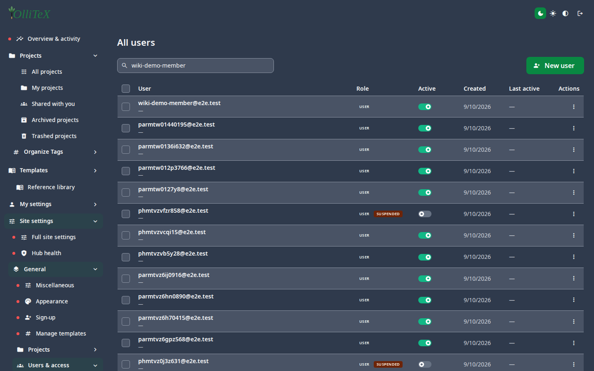
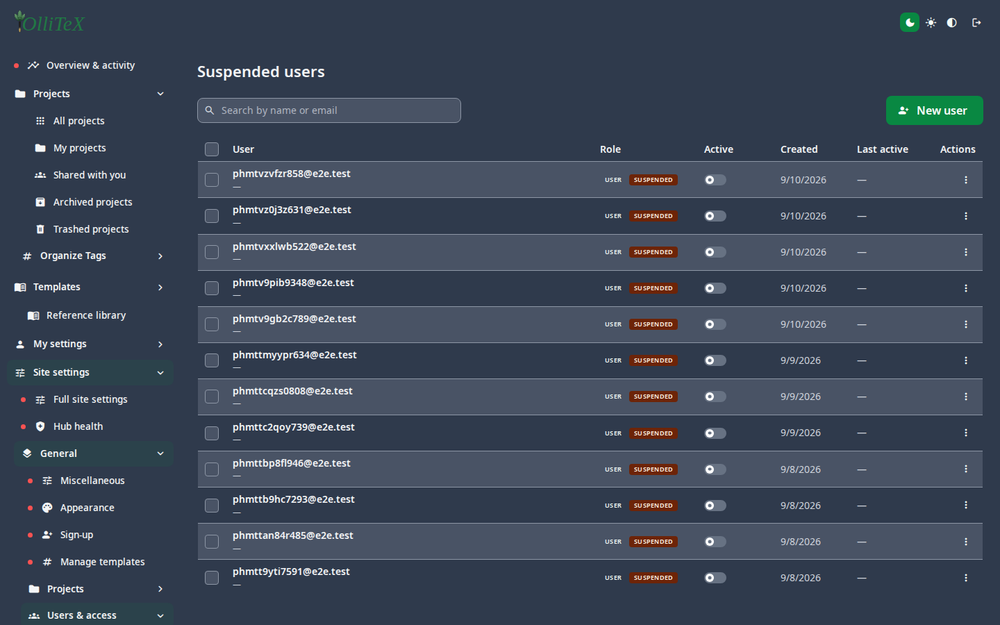

# Users (admin)

Goal: administer every account on the instance.

Home: **Hub → Site settings → General → Users & access**
(`/hub#/site.general.users.all`).

## Views

| Leaf | What it shows |
|---|---|
| All users | `/hub#/site.general.users.all` |
| Administrators | `/hub#/site.general.users.admins` |
| Suspended users | `/hub#/site.general.users.suspended` |
| Inactive users | `/hub#/site.general.users.inactive` |
| Deleted users | `/hub#/site.general.users.deleted` (purge or restore) |

The list supports **search by name or e-mail**, **bulk selection**, and row
**Actions** (info, update, send activation, suspend, delete):

## Creating an account

1. **New user** (top of the list).
2. Fill in first name, last name, and e-mail.
3. Choose **Create** — the user receives an activation e-mail (requires
   [SMTP](04-site-settings.md#email--smtp)).

## Common operations

- **Suspend** — blocks sign-in but keeps the account (use for lockouts).
- **Delete** — soft-deletes; the account appears under **Deleted users**
  where it can be **purged** (permanent) or restored.
- **Promote** — tick the administrator role on a row to grant the full
  Site settings rail.
- **Audit** — each action is recorded in the user audit log (internal).

> Data-safety note for admins: never export e-mail lists or credentials to
> documents or tickets; use the in-app search (as above) instead.

***

Verified against: OlliTeX @ `f827b5ceb9` (2026-09-16)
