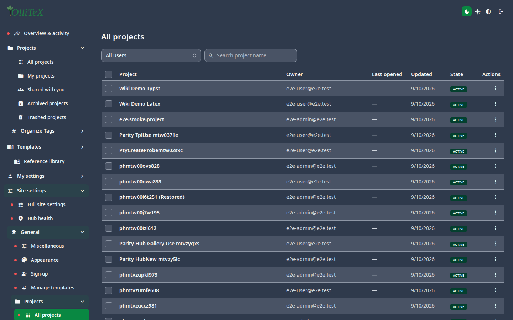
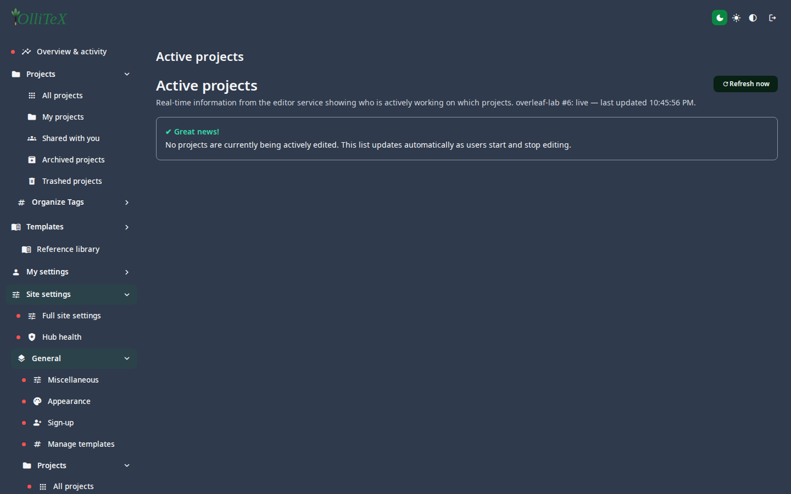

# Projects (admin)

Goal: see, share, archive, and purge every project on the instance.

Home: **Hub → Site settings → General → Projects**
(`/hub#/site.general.projects.all`).

## Views

| Leaf | Content |
|---|---|
| All projects | `/hub#/site.general.projects.all` |
| Inactive projects | `/hub#/site.general.projects.inactive` |
| Trashed projects | `/hub#/site.general.projects.trashed` (restore or purge) |
| Deleted projects | `/hub#/site.general.projects.deleted` (purge permanently) |

Row actions: **owner info**, **Change owner**, **Share** (invite e-mail +
role), **Trash/Restore**, **Purge**, **Download zip**.

## Active projects

**Active projects** (`/hub#/site.general.activeprojects`) lists projects
with live editing sessions right now — the first place to look when
something behaves oddly:

## Deleting properly

1. Soft-deleted projects sit in **Trashed projects** (visible to their
   owner there too).
2. **Purge** from **Deleted projects** is permanent and frees storage —
   make sure no one needs the project first.

***

Verified against: OlliTeX @ `f827b5ceb9` (2026-09-16)
