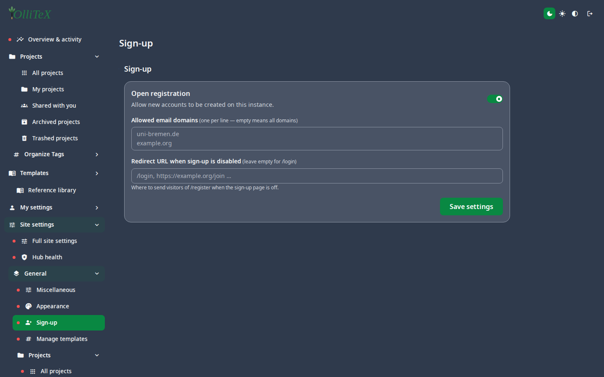
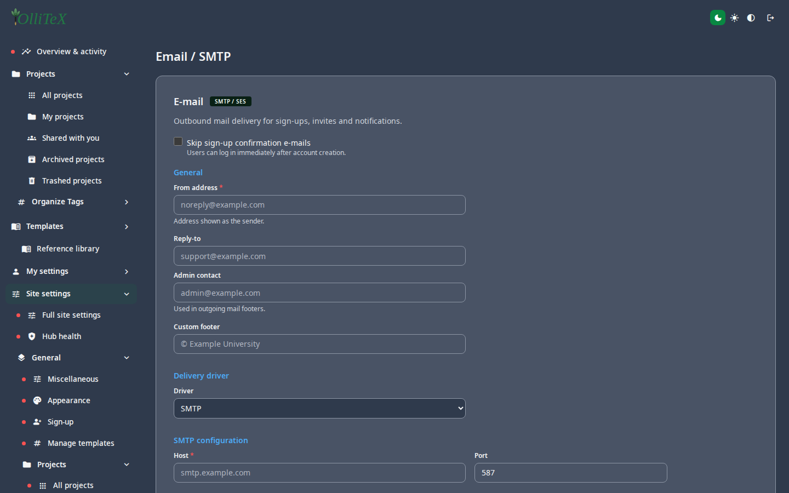

# Site settings (admin)

Goal: configure the instance — name, e-mail, sign-up, and services.

Home: **Hub → Site settings** (the whole rail). Each leaf is a small,
focused panel with a save button.

## General

| Leaf | Path | Purpose |
|---|---|---|
| Miscellaneous | `/hub#/site.general.misc` | site name, URL, misc switches |
| Appearance | `/hub#/site.general.appearance` | default instance theme |
| Sign-up | `/hub#/site.general.signup` | allow new accounts; activation e-mail |

## Email / SMTP

Outgoing e-mail (invitations, activation, password reset, test-mail) is
configured here — **Hub → Site settings → Services → Email / SMTP**
(`/hub#/site.services.email`):

- SMTP host / port / security (TLS/STARTTLS), username & password
  (stored encrypted — never written to logs or docs).
- **Test e-mail** button: sends a one-off message so you can verify the
  relay works before relying on invitation flows.

> If the instance was set up without SMTP, password-reset e-mails and
> account activation are inert until you fill this in.

## Other services

- **Branding** (`/hub#/site.services.branding`) — site title/favicon
  overrides.
- **Grammar (LT)** (`/hub#/site.services.grammar`) — the LanguageTool
  endpoint used by the grammar feature
  ([users: AI features](../users/05-ai-features.md)).

***

Verified against: OlliTeX @ `f827b5ceb9` (2026-09-16)
