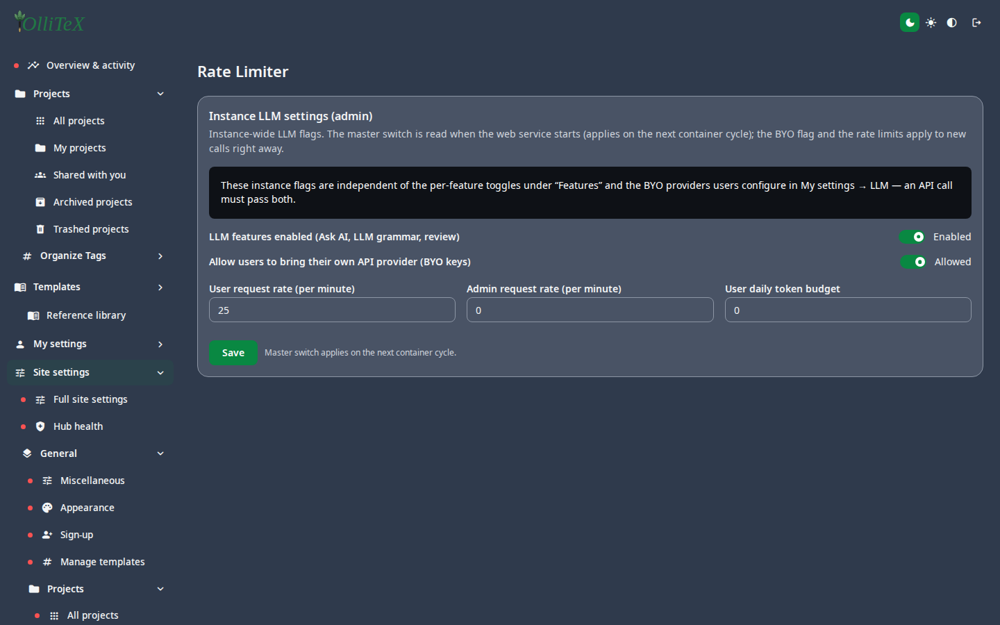
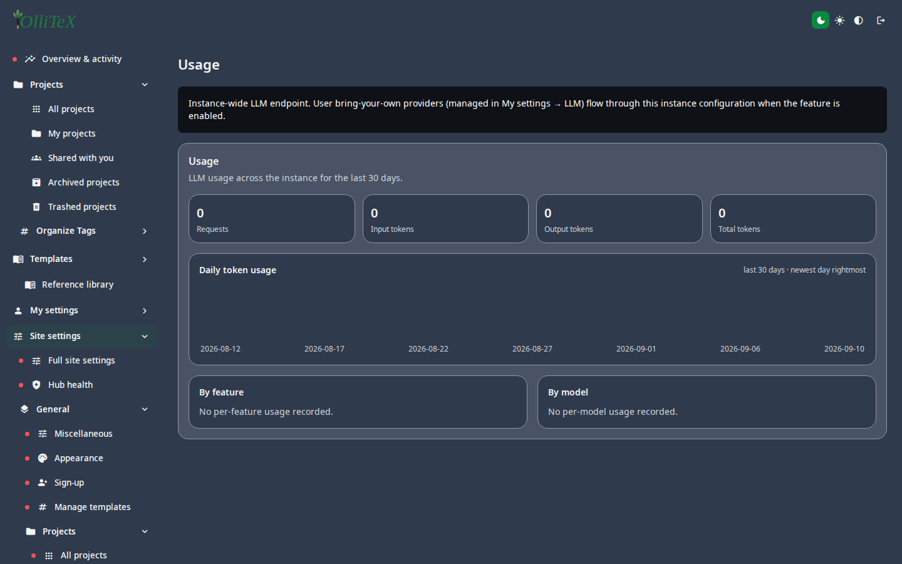

# LLM settings & Rate Limiter (admin)

Goal: control the AI features instance-wide — master switch, BYO policy,
per-user/per-admin rates, and token budgets.

Home: **Hub → Site settings → LLM Settings** (`/hub#/site.llm/…`).

## Rate Limiter (the master switch)

**Hub → Site settings → LLM Settings → Rate Limiter**
(`/hub#/site.llm.instance`):

- **Enabled** — master switch for the instance LLM surface.
- **Bring your own provider (BYO)** — allow users to attach their own
  OpenAI-compatible endpoints ([users: BYO](../users/05-ai-features.md)).
- **User / admin rate limits** and **daily token budgets** — per-feature
  throttling so a single user cannot burn the instance's quota.

## Per-feature configuration

| Leaf | Path | Controls |
|---|---|---|
| Features | `/hub#/site.llm.features` | which AI features exist (chat, completion, review) |
| API Connection | `/hub#/site.llm.connection` | the instance's own endpoint (when not BYO) |
| Model Selection | `/hub#/site.llm.models` | allowed model list + defaults |
| System Prompt | `/hub#/site.llm.prompt` | the base prompt |
| AI Prompts | `/hub#/site.llm.prompts` | per-feature prompt tuning |
| Usage | `/hub#/site.llm.usage` | live consumption vs budgets |

## Behavior notes

- Endpoint base URLs that are loopback / private ranges are **rejected** on
  save (a misconfigured key should never point at the box itself).
- API keys (instance or BYO) are stored encrypted and **never echoed** by
  the API or the UI.
- Turning a feature off hides it from the editor rails immediately; in-flight
  requests finish but new ones are denied.

***

Verified against: OlliTeX @ `f827b5ceb9` (2026-09-16)
