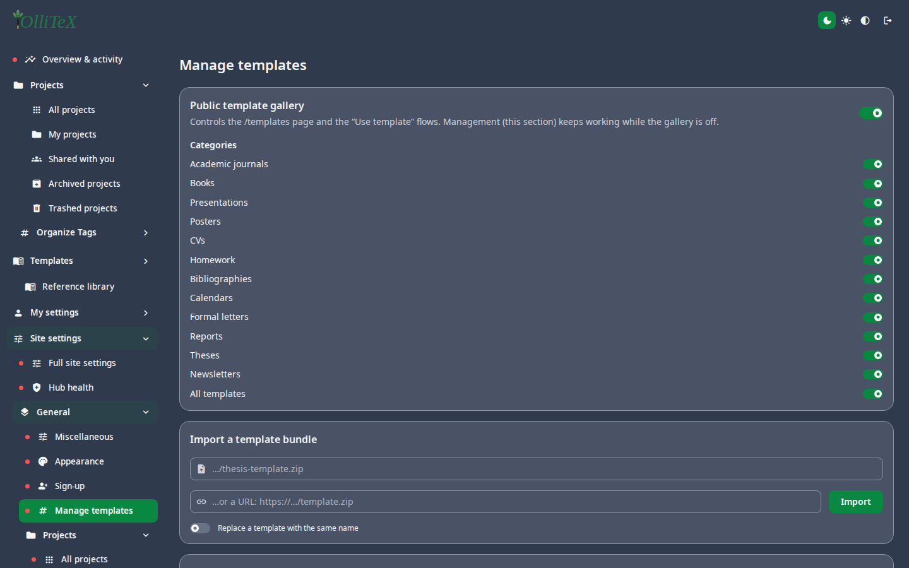

# Templates (admin)

Goal: manage the gallery that users see on **New project → Templates**.

Home: **Hub → Site settings → General → Manage templates**
(`/hub#/site.general.managetpl`).

- **Add** a template: upload a project zip / pick a project — it becomes
  available to all users with a name + description.
- **Publish / unpublish** — controls gallery visibility.
- **Categories** — organize the gallery (academics, books, presentations,
  …); the categories appear under **Hub → Templates** in every workspace.
- **Remove** — takes the template out of the gallery (projects created from
  it are unaffected).

## User side

Users browse the same gallery on **Hub → Templates** (`/hub#/templates`)
and start a project from any published template:

> The **Typst** templates (blank / article / example) are built in and do
> not need gallery management — see
> [The Typst editor](../users/04-editor-typst.md).

***

Verified against: OlliTeX @ `f827b5ceb9` (2026-09-16)
