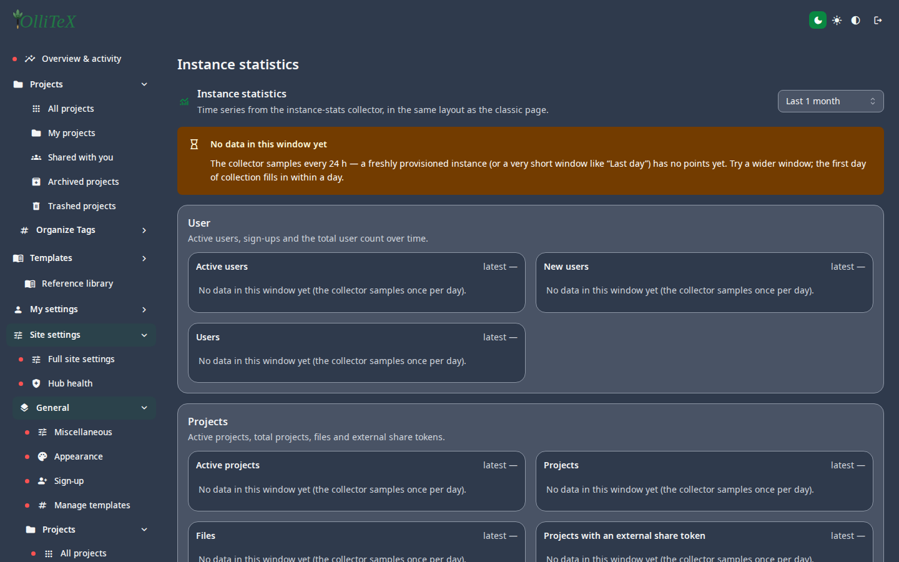

# Instance statistics (admin)

Goal: read the instance's health and usage.

**Hub → Site settings → General → Instance statistics**
(`/hub#/site.general.stats`) shows time-series charts of compiles, active
users, and feature usage over time.

## Reading the numbers

- **Compiles** — total + failure share; a rising failure share usually
  means a template broke or a TeX-live image changed.
- **Active users / projects** — growth trend for capacity planning.
- **LLM usage** — token consumption vs the budgets set on the
  [Rate Limiter](05-llm-rate-limiter.md).

## Operational notes

- The stats are derived on the web service — no extra collector to run.
- Retention follows the Mongo storage policy of the instance.
- For incident triage, pair the stats with **Active projects**
  ([Projects](03-projects.md)) and the web logs on the box.

***

Verified against: OlliTeX @ `f827b5ceb9` (2026-09-16)
