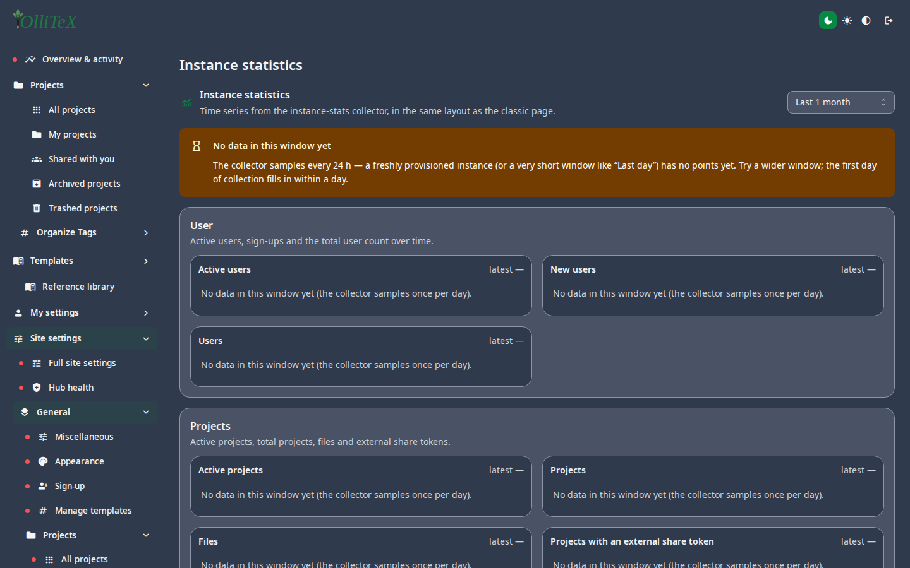

# Instance statistics (admin)

Goal: read the instance's health and usage — in the hub, **and** in Grafana.

## In the hub

**Site settings → General → Instance statistics**
(`/admin-settings/site.general.stats`) shows time-series charts of compiles,
active users, and feature usage over time.

## Reading the numbers

- **Compiles** — total + failure share; a rising failure share usually
  means a template broke or a TeX Live image/line changed.
- **Active users / projects** — growth trend for capacity planning.
- **LLM usage** — token consumption vs the budgets set on the
  [Rate Limiter](05-llm-rate-limiter.md).

## Grafana (self-hosted, admin-gated)

The standard toolkit ships a **self-hosted Grafana** with an
"OlliTeX instance stats" dashboard, reachable **only through the admin-gated
same-origin proxy** in the web service — the Grafana port is not exposed to
the internet, and anonymous access is off. The proxy:

- requires a signed-in **site admin** (non-admins get the restricted view),
- locks the upstream to the instance-local Grafana URL (no SSRF — the admin
  cannot repoint the proxy at arbitrary hosts),
- relays the dashboard + its panel queries exactly as served by local
  Grafana.

## Prometheus + alert relay

- A **Prometheus** service scrapes the instance metrics endpoint and
  evaluates the bundled rules (six alert rules under
  `toolkit/lib/monitoring/prometheus/rules/instance-stats.yml` — compile
  failure spikes, queue depth, and the core availability checks).
- Firing alerts are relayed to a webhook via
  `images/main-amd64/cron/alert-relay.sh` (a cron job inside the web
  image). The webhook endpoint is **token-gated**: the shared secret goes
  in the `INTERNAL_ALERTS_TOKEN` header only — never in the browser, never
  in the URL.
- Dashboards live at
  `toolkit/lib/monitoring/grafana/dashboards/ollitex-instance-stats.json`.

## Operational notes

- The hub stats are derived on the web service — no extra collector to run.
- Retention follows the Mongo storage policy of the instance; Grafana/Prometheus
  keep their own windows (see the toolkit compose file).
- For incident triage, pair the stats with **Active projects**
  ([Projects](03-projects.md)) and the web logs on the box.
- If you must screenshot a dashboard for docs/tickets: the dashboards are
  anon-safe by configuration — but **redact any absolute hostnames, e-mail
  addresses, or alert-webhook URLs** before they leave the machine (the
  leak guard applies to Grafana screenshots exactly like any other).

***

Verified against: OlliTeX v25/26 surface (2026-10-11): Grafana-oss 11.6.0
(anonymous off), Prometheus v2.53.5 (6 rules), admin-gated same-origin
proxy, token-gated `/internal/alerts`, bundled dashboards + alert relay cron
on the dev instance.
