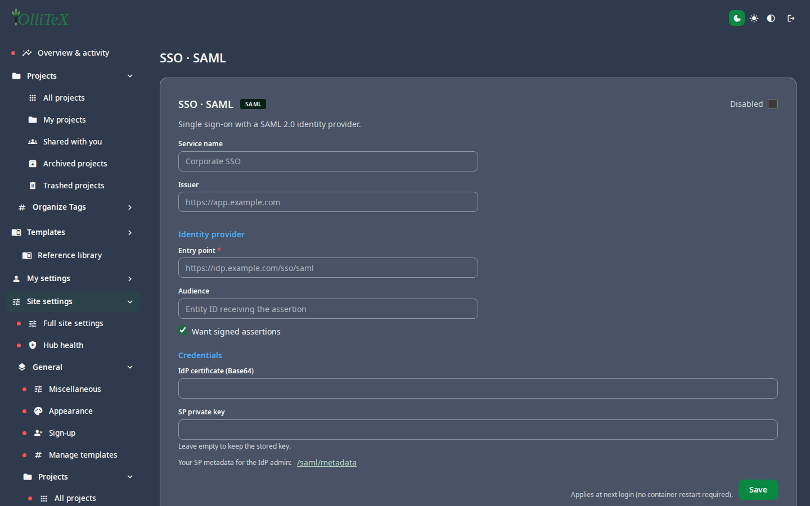

# SSO & integrations (admin)

Goal: let people sign in with the institution's identity provider and
connect reference tools.

Home: **Hub → Site settings → Integrations** (`/hub#/site.integrations/…`).

## Single sign-on

| Provider | Leaf | Notes |
|---|---|---|
| SAML | `/hub#/site.integrations.sso-saml` | IdP entity id, SSO/ACS URLs, certificate |
| OIDC | `/hub#/site.integrations.sso-oidc` | discovery URL or issuer, client id/secret |
| LDAP | `/hub#/site.integrations.sso-ldap` | server, base DN, bind settings |

When a provider is enabled, the login page offers **Institutional login**
alongside e-mail/password; account claims (e-mail, first/last name) map to
the OlliTeX user automatically.

### OIDC claim mapping & admin promotion

The **SSO · OIDC** leaf also covers the claim-mapping fields (previously
env/DB-only, added 2026-09-12):

| Field | Purpose |
|---|---|
| User ID claim | claim used as the stable OIDC user id (`email` = use the e-mail) |
| Update profile on login | refresh name/e-mail from the IdP at each login |
| Admin claim / Admin claim value | claim (+ expected value) that promotes a user to **site admin** (`email` allowed) |
| Allowed email domains | optional comma-separated domain allow-list |

Non-standard claims (e.g. `groups`, `role`) are matched against the **raw
userinfo payload, with UserInfo taking priority over ID-token claims** —
ported from the community fix by Juan Antonio Zuloaga Mellino (@xvan),
see CREDITS.md. The legacy `/user/mysettings` settings page is removed
since 2026-09-12: the URL now 301-redirects to the hub
(`/hub#/mysettings.account`).

> Secrets (IdP private keys, OIDC client secrets, LDAP bind passwords) are
> stored encrypted server-side. Describe them in runbooks by **name and
> purpose only** — never paste the actual values.

## Reference & file integrations

| Leaf | Purpose |
|---|---|
| Zotero | `/hub#/site.integrations.zotero` — enable + connector settings ([users: references](../users/06-references.md)) |
| Mendeley | `/hub#/site.integrations.mendeley` — connector credentials |
| External URLs | `/hub#/site.integrations.externalurl` — allowed import URLs |

The compilation-side switches (GitHub sync, WebDAV, Dropbox, linked file
types) live under
**Compilation** — see [Site settings](04-site-settings.md) and
[users: sync & integrations](../users/08-sync-integrations.md).

***

Verified against: OlliTeX @ `f827b5ceb9` (2026-09-16)
