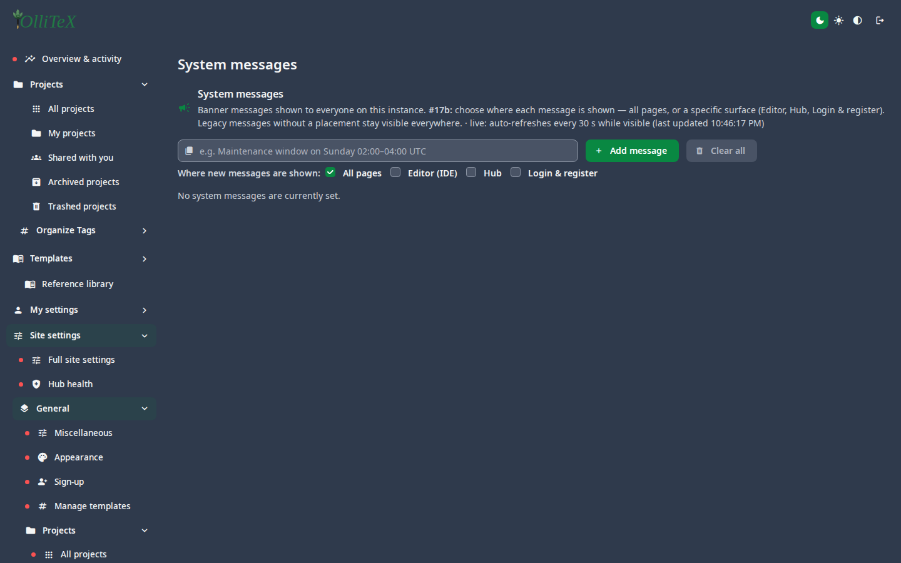

# Operations (admin)

Goal: broadcast to users, inspect live sessions, and check the instance.

## System messages

**Hub → Site settings → General → System messages**
(`/hub#/site.general.messages`) — create a dismissible banner for all (or
part of) the users: maintenance windows, new features, outages.

## Active projects & sessions

- **Active projects** (`/hub#/site.general.activeprojects`) — who is
  editing what, right now ([Projects](03-projects.md)).
- **Sessions** — per-user active browser sessions under
  [Users](02-users.md); the Sessions leaf also appears in each user's own
  My settings.

## Editor controls

**Editor controls** (`/hub#/site.general.editor`) — instance defaults for
the editor (e.g. default panes, history size).

## Health checks

- Open `/hub#/overview` — the admin overview with shortcut cards and the
  hub health section.
- The compose healthcheck on the box (`overleafserver` HEALTHY after a
  cycle) is the source of truth for deploys — see
  [Installation: upgrade](../installation/03-upgrade.md).

***

Verified against: OlliTeX @ `f827b5ceb9` (2026-09-16)
