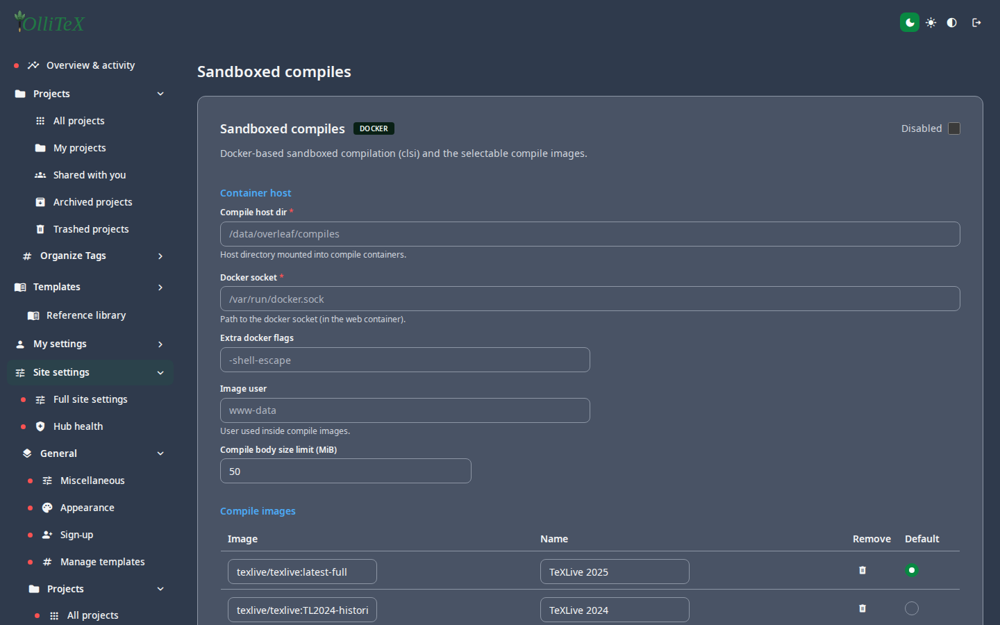

# Security & sandboxed compiles (installation)

Goal: understand the trust model and keep compiles contained.

## The headline

> Community Edition is intended for environments where **all** users are
> trusted. Where they are not, **Sandboxed Compiles must be on** — with it
> off, a project's compile process can read/write the `sharelatex`
> container's filesystem, network, and environment variables.

## Sandboxed compiles

**Hub → Site settings → Compilation → Sandboxed compiles**
(`/hub#/site.compilation.sandboxed`) — toggle the sandbox mode for
compiles (Docker-isolated compile containers):

- Compiles run in a restricted image; the allowed image list is managed in
  `tools/toolkit/lib/images.env` (single source of truth for the
  `sharelatex` → `ollitex` image names).
- LaTeX uses the TeX Live image; Typst uses the `typst` compile image.

## Credential hygiene

- **Never** put SMTP credentials, SSO secrets, or LLM API keys into
  documents, tickets, or the wiki — this repo's wiki gate scans for key
  patterns and real e-mail domains and fails the build if it finds them
  (see [AUDIT.md](../AUDIT.md) for a receipt).
- LLM base URLs pointing at loopback/private ranges are rejected at save
  time (a provider endpoint should never be the box itself).
- CSRF: the site URL (`OVERLEAF_SITE_URL`) is the allowed origin — set it
  exactly to the public URL or form/API submissions 403.

## User isolation (when untrusted users exist)

- Sandboxed compiles **on**
- Per-user rate limits where relevant (compiles, LLM budgets)
- Audit: user/project audit logs are retained in Mongo

***

Verified against: OlliTeX @ `f827b5ceb9` (2026-09-16)
