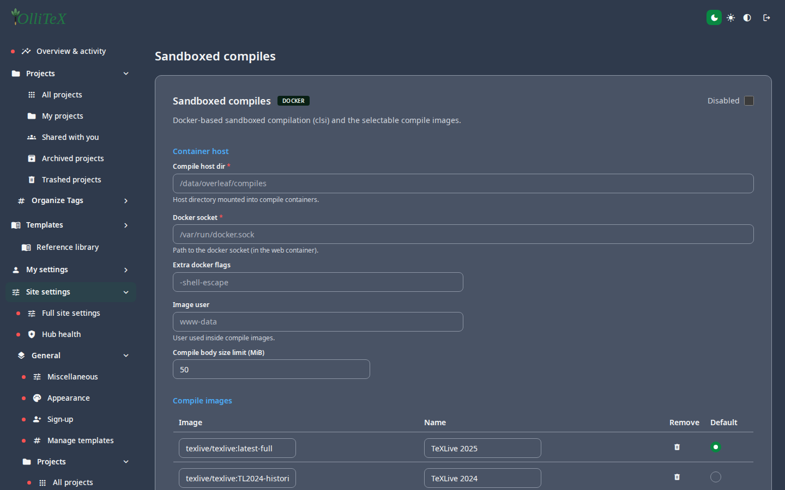

# Security & sandboxed compiles (installation)

Goal: understand the trust model and keep compiles contained.

## The headline

> Community Edition is intended for environments where **all** users are
> trusted. Where they are not, **Sandboxed Compiles must be on** — with it
> off, a project's compile process can read/write the `sharelatex`
> container's filesystem, network, and environment variables.

## Sandboxed compiles

**Site settings → Compilation → Sandboxed compiles**
(`/admin-settings/site.compilation.sandboxed`) — toggle the sandbox mode for
compiles (Docker-isolated compile containers):

- Compiles run in a restricted image; the default is **TeX Live 2026**
  (`olpsint/texlive-full:2026.1`, built from the ayaka-notes 2026 recipe —
  see [06-texlive-2026.md](06-texlive-2026.md)); Typst uses its dedicated
  compile image. The allowed image list is managed in the site settings +
  `toolkit/lib/images.env` (single source of truth for the
  `sharelatex` → `ollitex` image names).
- **Seccomp:** the compile containers additionally run under a seccomp
  profile **embedded in the Go `clsitex` binary** (`//go:embed`;
  source of truth `go/services/clsitex/config/seccomp/clsi-profile.json` —
  179 syscalls, e.g. `faccessat2` for the TeX Live 2026 toolchain). A
  profile regression surfaces as sandboxed compiles failing on a
  syscall-restricted path — audit the profile whenever the TeX Live line
  changes.

## Credential hygiene (leak guard — HARD RULE)

**No credentials, API keys, tokens, or secrets in any README, wiki page,
screenshot, or ticket that can reach GitHub or a shared channel.** Before
shipping docs:

- **Sweep** the doc text with key patterns: `api[_-]?key`, `secret`,
  `password`, `bearer`, `sk-`, JWT `eyJ…`, SMTP credentials, long hex/base64
  blobs — placeholders only (`user@example.org`, `changeme`, `••••••••`).
- **Screenshot review:** every image must be checked for e-mail addresses,
  usernames, dashboard tokens, alert e-mails, API keys, session ids —
  redact or re-shoot on an anon-safe fixture.
- **Never in the docs:** the instance's SMTP credentials, test/dev account
  names, owner e-mails + passwords, Wakapi/wakatime keys, Grafana API keys,
  SSO client secrets, the `INTERNAL_ALERTS_TOKEN` value. These live in the
  instance secret store / env vars only.
- The wiki gate scans for key patterns and real e-mail domains and fails if
  it finds them (see [AUDIT.md](../AUDIT.md) for the receipt).
- LLM base URLs pointing at loopback/private ranges are rejected at save
  time (a provider endpoint should never be the box itself).
- CSRF: the site URL (`OVERLEAF_SITE_URL`) is the allowed origin — set it
  exactly to the public URL or form/API submissions 403.

## User isolation (when untrusted users exist)

- Sandboxed compiles **on**
- Per-user rate limits where relevant (compiles, LLM budgets)
- Audit: user/project audit logs are retained in Mongo

***

Verified against: OlliTeX v26 surface (2026-10-11): default TeX Live 2026
image, seccomp source
`go/services/clsitex/config/seccomp/clsi-profile.json` (embedded, 179
syscalls), LLM loopback/private-URL rejection at save, CSRF origin pinning.
