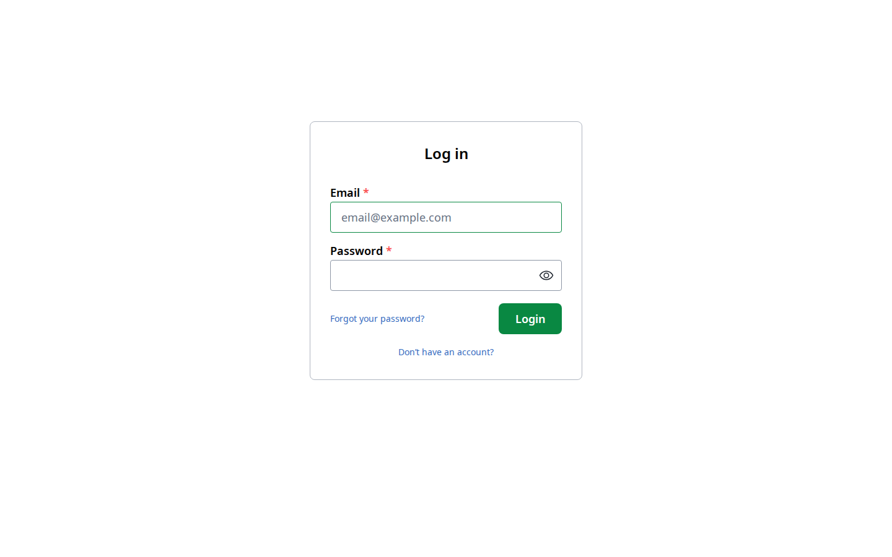
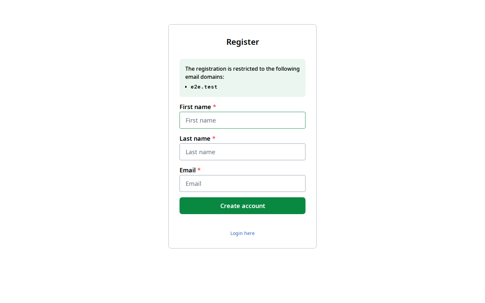
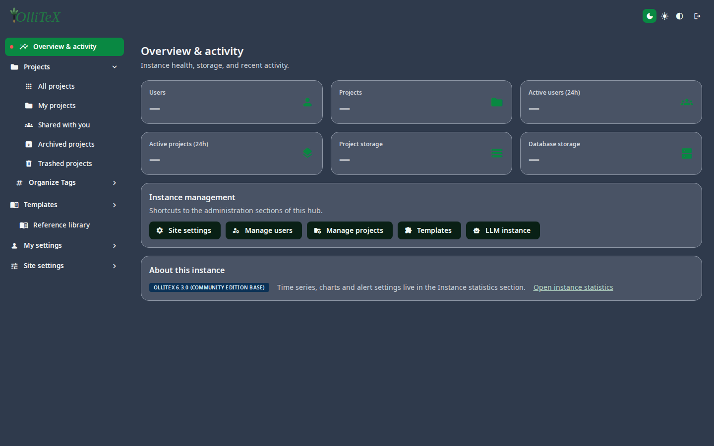
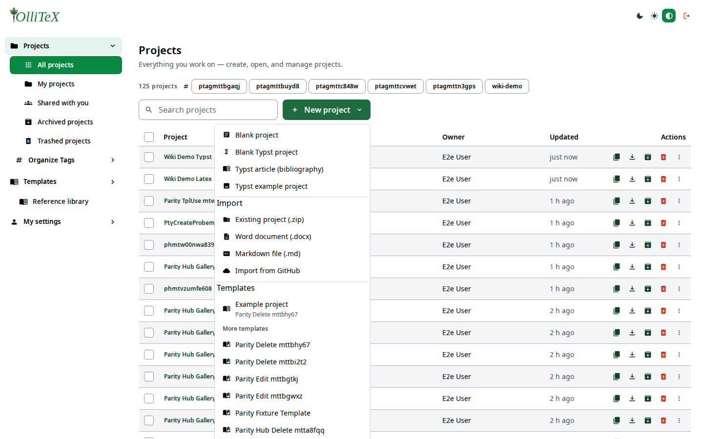

# Getting started (users)

Goal: sign in, find your way around the hub, and create your first project.

## Signing in

Open the instance URL (e.g. `https://<your-instance>/login`). Enter your
e-mail and password and choose **Sign in**.

If your institution uses single sign-on, the admin may have enabled SSO —
see [SSO · SAML / OIDC / LDAP](../admins/08-sso-saml-oidc.md). New users can
create an account on the registration page (if the admin allows sign-up):

## The hub

After sign-in you land on the **hub** at `/hub` — one page with two rail
sections:

- **Workspace** (left/top): your projects, templates, reference library, and
  *My settings*.
- **Site settings** (bottom, admins only): the full instance administration
  surface.

Every leaf has a deep link: `/hub#/<path>`. For example:

- `/hub#/projects.all` — all your projects
- `/hub#/library` — the shared reference library
- `/hub#/mysettings.email` — your e-mail preferences

## Creating your first project

1. On **Projects → All projects**, click **New project**.
2. Choose the starting point:

   - **Blank project** — an empty LaTeX project (main.tex + bibtex.bib).
   - **Blank Typst project** — an empty Typst project (main.typ).
   - **Typst article (bibliography)** or **Typst example project** — Typst
     templates with sample content.
   - An **Import** option (zip, Word, Markdown, GitHub) or a **template**
     from the gallery.
3. Name it and choose **Create**.

You are dropped straight into the editor — see
[The LaTeX editor](03-editor-latex.md) or
[The Typst editor](04-editor-typst.md).

## First compile

Click **Recompile** (or press `Ctrl/Cmd + Enter`) in the toolbar. The PDF
appears in the preview pane on the right; compile output and errors show in
the log pane.

## Where do I go from here?

- [Projects: tags, search, trash](02-projects.md)
- [AI features](05-ai-features.md) — ask AI questions, inline completion,
  grammar checking, and your own LLM provider.
- [Sync & integrations](08-sync-integrations.md) — GitHub, WebDAV/Nextcloud,
  Dropbox.
- [My settings](09-settings.md) — appearance, e-mail preferences, sessions.

***

Verified against: OlliTeX @ `f827b5ceb9` (2026-09-16)
