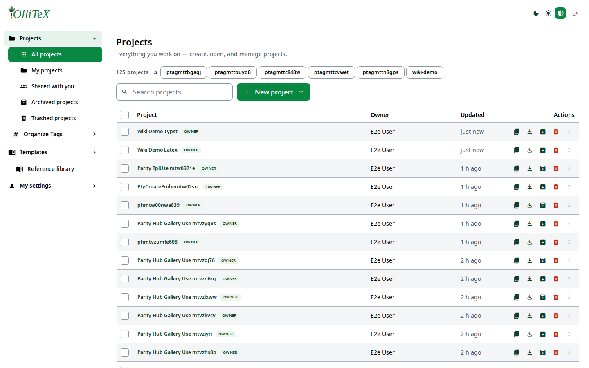
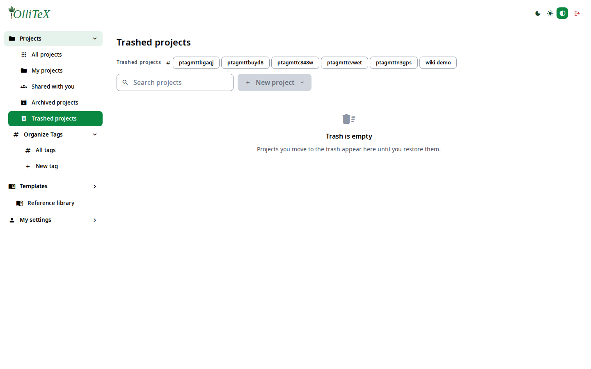
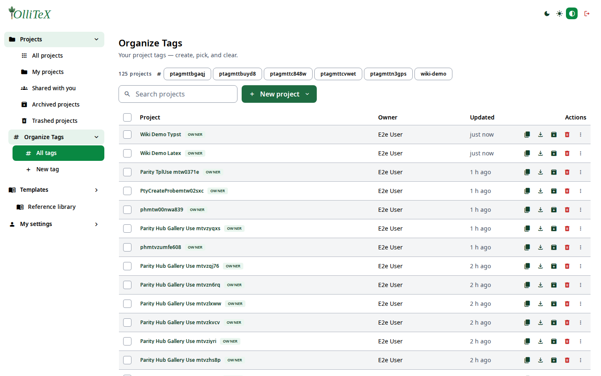

# Projects (users)

Goal: create, find, organize, and manage your projects.

Home base: **Hub → Projects** (`/hub#/projects`).

## Views

| Leaf | Deep link | What you see |
|---|---|---|
| All projects | `/hub#/projects.all` | everything you own or are shared |
| My projects | `/hub#/projects.owned` | owned by you |
| Shared with you | `/hub#/projects.shared` | invited to |
| Archived projects | `/hub#/projects.archived` | archived (read-only-ish workspace) |
| Trashed projects | `/hub#/projects.trashed` | soft-deleted — restore from here |
| Organize Tags | `/hub#/projects.tags.tags` | create tags and filter by them |

## Searching

Use the **Search projects** box on the leaf — it filters by name as you type
and the query is kept in the URL (`#/projects.all?q=…`), so searches are
bookmarkable.

## Organizing with tags

1. **Hub → Projects → Organize Tags → New tag** (`/hub#/projects.tags.new`).
2. Name the tag (e.g. `wiki-demo`) and save.
3. On **All projects**, select one or more rows and choose **Add to tag** —
   or pick a tag from the tag switcher above the list to filter by it.

## Creating a project

**New project** → pick the starting point (Blank, Blank Typst, Typst
templates, Import, or a gallery template) → name → **Create**.
See [Getting started](01-getting-started.md#creating-your-first-project).

## Deleting & restoring

- **Move to trash** (row action) soft-deletes a project.
- Find it under **Trashed projects** (user) or the admin trashed view —
  **Restore** brings it back.
- Deleting permanently requires the admin **deleted** view — see
  [Admin: projects](../admins/03-projects.md).

***

Verified against: OlliTeX @ `f827b5ceb9` (2026-09-16)
