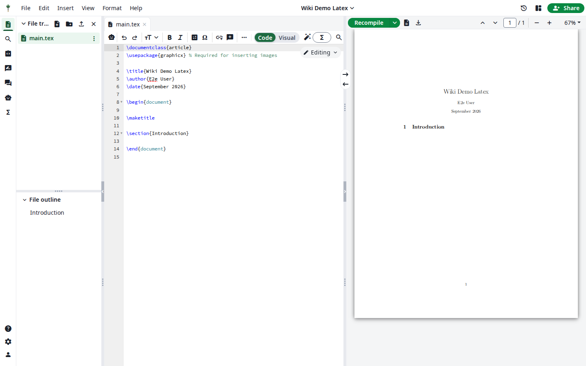
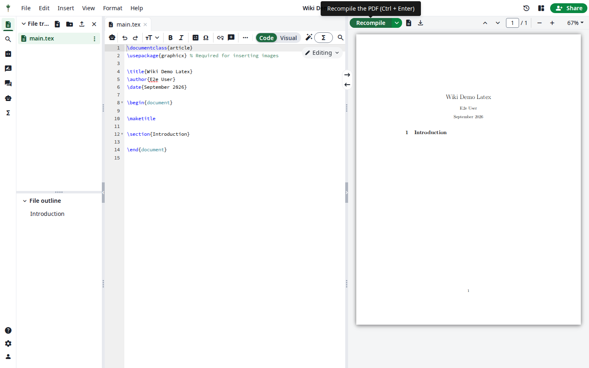
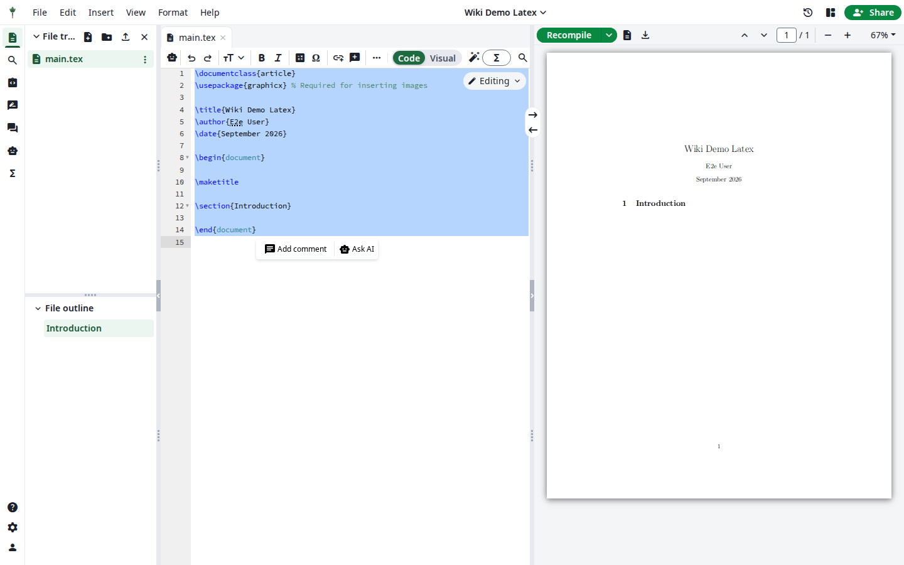

# The LaTeX editor (users)

Goal: edit, compile, comment, and collaborate on a LaTeX project.

Open a project from **Hub → Projects** — you land in the editor at
`/project/<id>` (the identical renovated route is `/editor/<id>`).

## Editing

- The source pane is a CodeMirror editor with LaTeX syntax highlighting.
- Standard shortcuts work: `Ctrl/Cmd + Enter` compiles.
- The **file tree** (left) manages files: create, rename, delete, upload,
  and import from external sources (Zotero, Mendeley, URL — see
  [File tools](07-file-tools.md)).

## Compiling

The toolbar's **Recompile** button (or `Ctrl/Cmd + Enter`) starts a compile.
The compile status (Running / Finished / Failed) updates in place; the PDF
lands in the preview pane and the log in the log pane.

Compile options (auto-compile, draft/fast mode, error handling) are in the
**dropdown** next to the Recompile button.

## Commenting & track changes

1. Select any text in the source.
2. Choose **Add comment** — a comment thread attaches to that selection and
   is visible to everyone in the project.

- **Track changes** (per-project, admin/user switch) inserts edits as
  tracked insertions/removals that collaborators can accept or reject.
- The **Review panel** (rail tab) lists all comments; the **History** panel
  shows the commit log and lets you diff snapshots.

## Working with references

- `bibtex.bib` ships in every blank project — add BibTeX entries directly,
  or via [reference managers](06-references.md).
- The bibliography pane / BibTeX editor validates entries inline.

***

Verified against: OlliTeX @ `f827b5ceb9` (2026-09-16)
