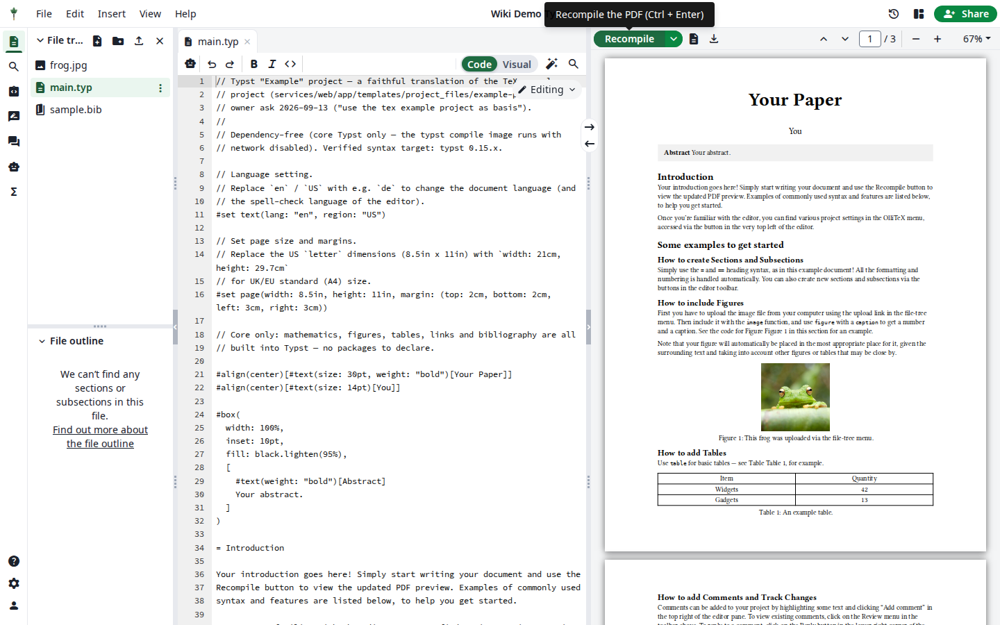

# The Typst editor (users)

Goal: create, edit, and compile Typst projects alongside LaTeX ones.

Typst is a first-class format in OlliTeX: a dedicated `clsi_typst` compile
service compiles `.typ` sources to PDF with the same tooling (log pane,
PDF preview, compile modes) as LaTeX.

## Creating a Typst project

**Hub → Projects → New project**, then pick one:

- **Blank Typst project** (`main.typ`),
- **Typst article (bibliography)** — article layout + `sample.bib`,
- **Typst example project** — a worked example exercising syntax,
  figures, and bibliography.

## Editing & compiling

The editor is the same as the LaTeX editor, with Typst syntax highlighting
and formatting available from the source toolbar.

- **Recompile** (`Ctrl/Cmd + Enter`) renders `output.pdf`.
- The example template includes a binary asset (`frog.jpg`) and a
  `#bibliography("sample.bib")` entry — both work out of the box.

## Practical notes

- Typst compiles run in the sandboxed `typst` image by default; the admin
  can extend the allowed images under Site settings → Compilation.
- Figures: reference them with `#figure(image("frog.jpg"), caption:[…])`.
- Bibliography: `#bibliography("sample.bib")` (no style argument for the
  pinned images).

***

Verified against: OlliTeX @ `f827b5ceb9` (2026-09-16)
