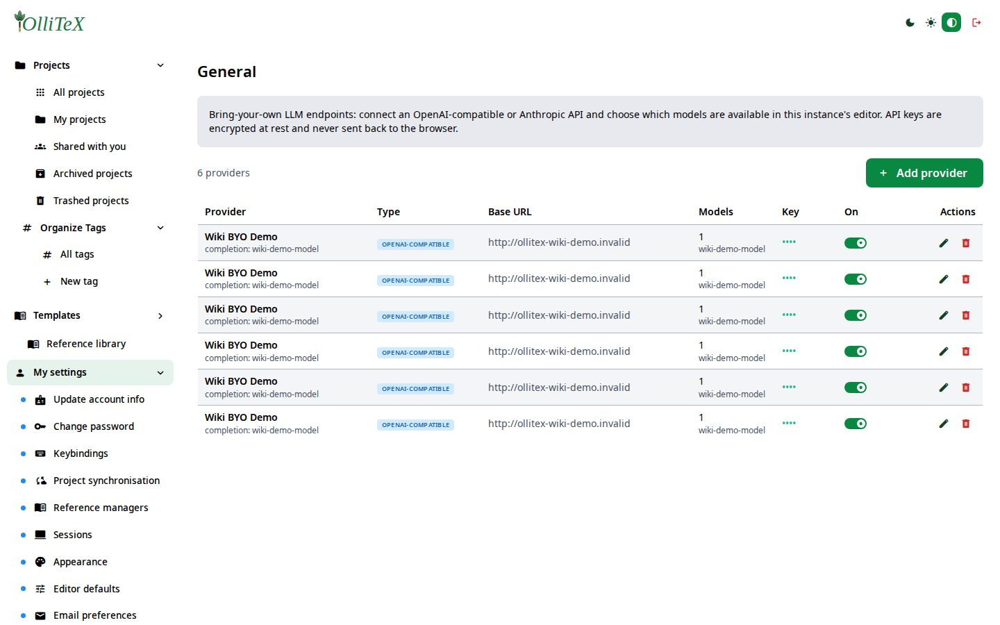
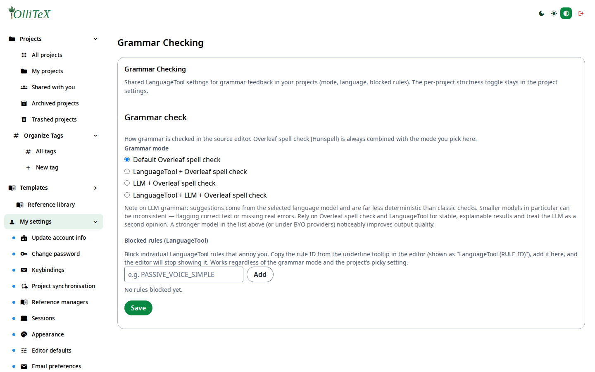
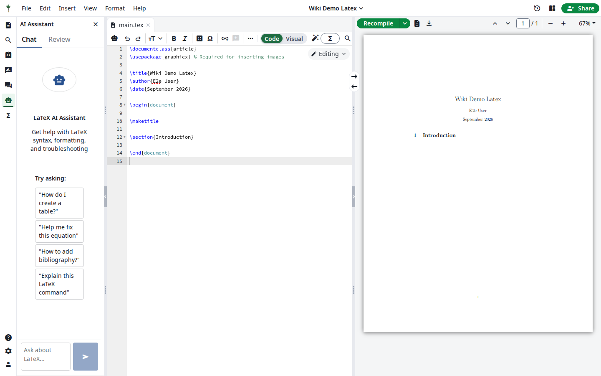

# AI features & your own LLM provider (users)

Goal: use the AI features (chat, completion, grammar, compliance) and point
them at **your own** LLM endpoint.

The admin can enable/disable each AI feature instance-wide and rate-limit
them (see [Rate Limiter](../admins/05-llm-rate-limiter.md)). Where the
instance has no hosted key, you bring your own provider (BYO).

## Your provider (BYO)

**Hub → My settings → My LLM settings → General**
(`/hub#/mysettings.llm.general`):

1. Choose **Add provider**.
2. Fill in:

   - **Name** — e.g. `wiki-demo`.
   - **Provider type** — OpenAI-compatible.
   - **Base URL** — the endpoint root (must be a reachable non-loopback
     URL; loopback/range addresses are blocked by design).
   - **API key** — stored encrypted, never echoed back.
   - **Models** — the model id(s) to offer; pick a default completion model.

3. Save, then **Check** to validate the endpoint (unreachable endpoints
   fail gracefully with a clear message — they never break the session).

> In this wiki the demo provider uses the placeholder key
> `sk-ollitex-dummy-do-not-use` against a name that intentionally does not
> resolve (`http://ollitex-wiki-demo.invalid`) — that is why “Check” shows a
> graceful failure in the screenshot.

## Grammar checking

**Hub → My settings → My LLM settings → Grammar Checking**
(`/hub#/mysettings.llm.grammar`) — choose between the self-hosted
LanguageTool service and/or an LLM for grammar suggestions in the editor.

## In the editor

Inside a project, the AI surface is available from the editor toolbar rail:

- **Ask AI** — chat about the document.
- **Inline completion / refine** — context-aware edits.
- **Compliance review** — check the document against compliance rules
  (admin-configurable).

## Usage

**Hub → My settings → My LLM settings → Usage**
(`/hub#/mysettings.llm.usage`) shows your per-feature consumption against
the limits the admin configured.

***

Verified against: OlliTeX @ `f827b5ceb9` (2026-09-16)
