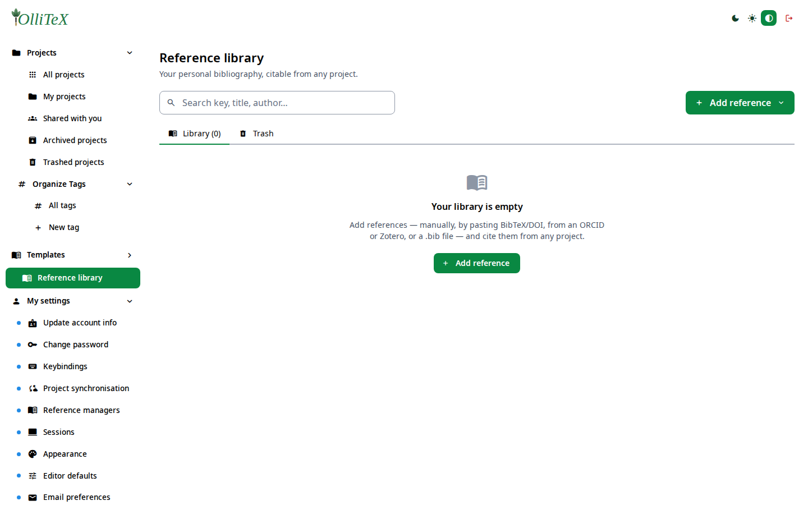
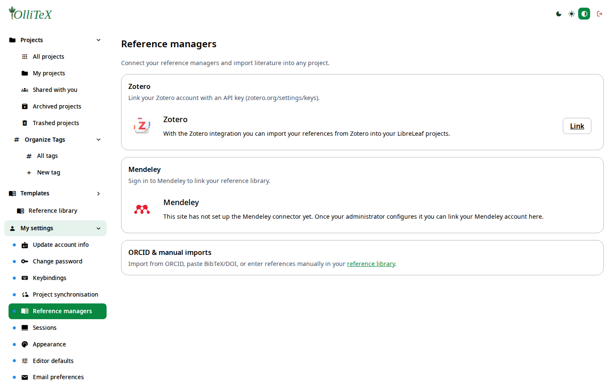

# Reference managers & bibliography (users)

Goal: feed citations from Zotero / Mendeley / BibTeX into your project.

## The shared reference library

**Hub → Reference library** (`/hub#/library`) is the instance-wide library
of BibTeX entries: add by pasting BibTeX, by DOI, uploading a `.bib` file,
searching ORCID, or importing from Zotero. Projects then pull entries from
it (see the **Import from Library** action in the file tree).

## Per-project bibliography

- Every blank LaTeX project ships `bibtex.bib`; `article`-style Typst
  templates ship `sample.bib`.
- The **BibTeX editor** pane validates entries inline and keeps the
  in-project file in sync.
- `~@key` (Typst) or `\cite{key}` (LaTeX) references resolve against the
  project bibliography + the library on compile.

## Your reference manager

**Hub → My settings → Project synchronisation → Reference managers**
(`/hub#/mysettings.references`) — link your own Zotero account (and, where
the admin enabled it, Mendeley) and import from it in the file tree:

## Admin side

Enabling/branding the integrations instance-wide:
[SSO, Zotero & Mendeley](../admins/08-sso-saml-oidc.md).

***

Verified against: OlliTeX @ `f827b5ceb9` (2026-09-16)
