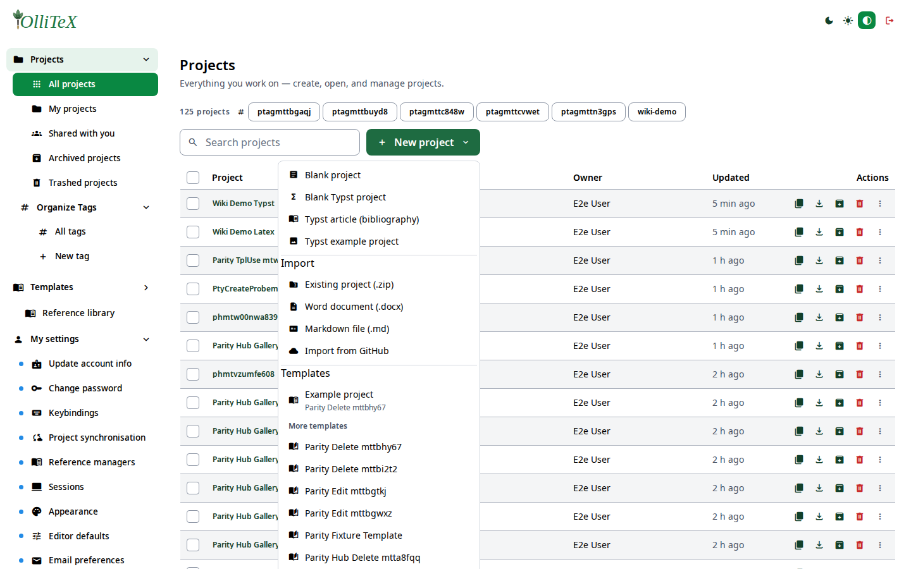

# File tools (users)

Goal: get files in and out of a project — import, export, linked files.

## Importing a project

**Hub → Projects → New project → Import**:
upload a zip, a Word/Markdown document, or a GitHub repository — OlliTeX
creates the project and runs the first compile for you.

## Inside a project

From the **file tree** you can:

- **Create** files/folders, **rename**, **delete**.
- **Upload** images and sources.
- **Import from** Zotero / Mendeley / external URL (where enabled by the
  admin) — these appear as *linked files*.
- **Linked file types** are admin-configured (Site settings → Compilation →
  Linked file types).

## Exporting

- **Download PDF** — from the project row action or after a compile.
- **Download zip** — the full project source (`/project/<id>/download/zip`;
  bulk export for several projects at once from the row checkboxes).

***

Verified against: OlliTeX @ `f827b5ceb9` (2026-09-16)
