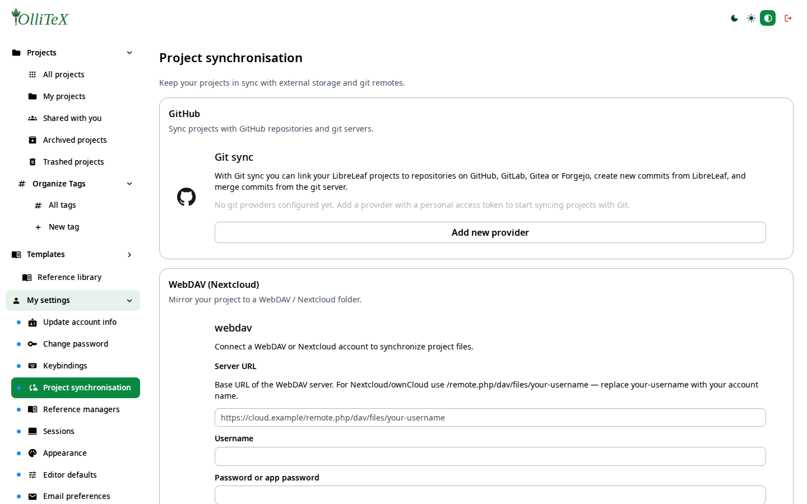
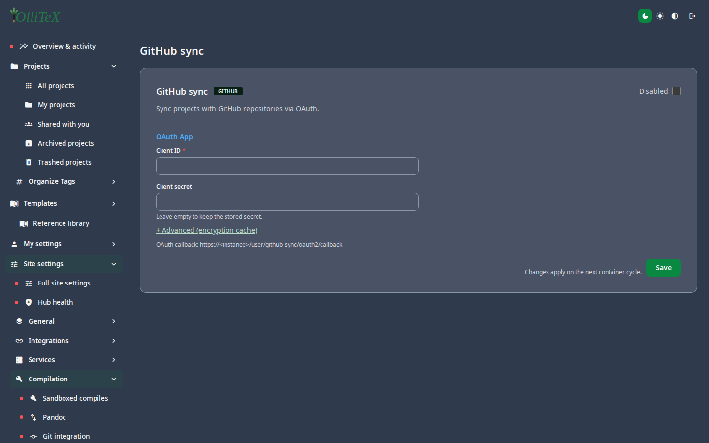

# Sync & integrations (users)

Goal: keep your project in sync with the systems you already use.

## WebDAV / Nextcloud

**Hub → My settings → Project synchronisation**
(`/hub#/mysettings.sync`) — connect a WebDAV endpoint (Nextcloud, ownCloud,
…) per project: OlliTeX pushes/pulls source files over WebDAV.

## GitHub sync (per project)

From a project's share/sync menu: **Connect GitHub repository** — pull
commits into the project and push back. The admin controls which GitHub
providers and servers are allowed:

See [Admin: site settings](../admins/04-site-settings.md) for the instance
switches (GitHub sync, WebDAV, Dropbox, external URLs).

## Dropbox

Dropbox import is available where the admin configured connector
credentials (Site settings → Compilation → Dropbox).

***

Verified against: OlliTeX @ `f827b5ceb9` (2026-09-16)
