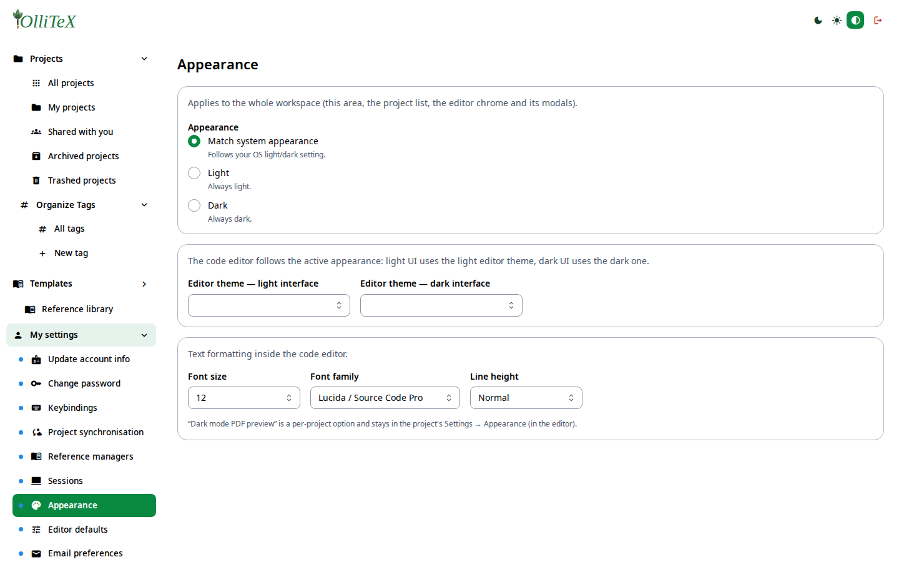
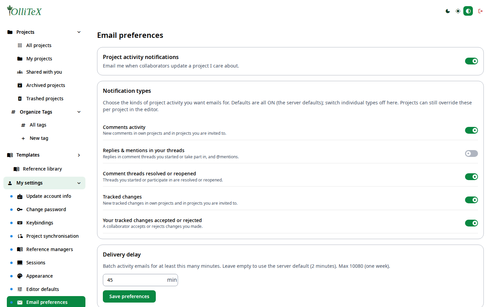

# My settings (users)

Goal: tune appearance, e-mail, editor defaults, and sessions.

All personal settings live under **Hub → My settings**
(`/hub#/mysettings/…`):

| Leaf | Deep link | What it controls |
|---|---|---|
| Update account info | `/hub#/mysettings.account` | name, profile |
| Change password | `/hub#/mysettings.password` | your password + 2FA if available |
| Keybindings | `/hub#/mysettings.keybindings` | editor shortcuts |
| Project synchronisation | `/hub#/mysettings.sync` | WebDAV/Nextcloud per project |
| Reference managers | `/hub#/mysettings.references` | Zotero/Mendeley links |
| Sessions | `/hub#/mysettings.sessions` | active web sessions, sign out others |
| Appearance | `/hub#/mysettings.appearance` | theme (light/dark/contrast) |
| Editor defaults | `/hub#/mysettings.editordefaults` | default editor/compiler options |
| Email preferences | `/hub#/mysettings.email` | digest & notification e-mails |
| My LLM settings | `/hub#/mysettings.llm.general` | BYO provider, grammar, compliance, usage |

## Appearance

Pick the color scheme for the whole instance (the editor follows it):

## E-mail preferences

Choose which e-mails you receive (activity digest, invitation notices,
project events):

***

Verified against: OlliTeX @ `f827b5ceb9` (2026-09-16)
