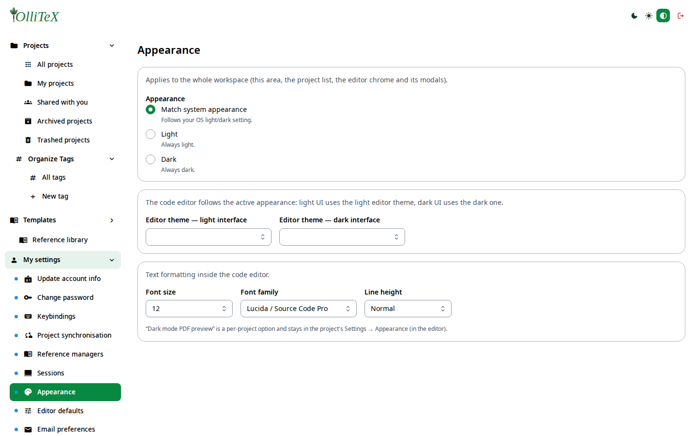
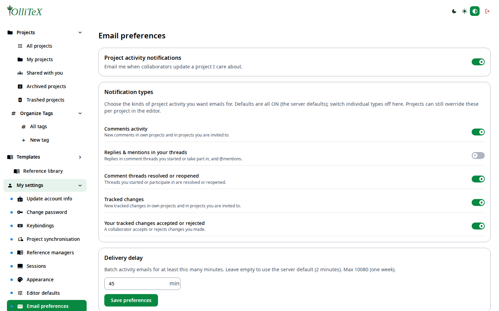

# My settings (users)

Goal: tune appearance, e-mail, editor defaults, keybindings, sessions,
WakaTime, and your LLM access.

All personal settings live under **My settings** — the sidebar in the hub,
or directly at the deep links below (the canonical addressable form is
`/user-settings/<leaf-id>`; the old `/hub#/…` hash form still resolves):

| Leaf | Deep link | What it controls |
|---|---|---|
| Update account info | `/user-settings/mysettings.account` | name, profile |
| Change password | `/user-settings/mysettings.password` | your password (per provider policy) |
| **Keybindings** | `/user-settings/mysettings.keybindings` | editor shortcuts (Default/Emacs/Vim schemes; the in-editor "Keyboard shortcuts" dialog links here) |
| Project synchronisation | `/user-settings/mysettings.sync` | WebDAV/Nextcloud per project |
| Git integration | `/user-settings/mysettings.gitsync` | your Git provider account link |
| Reference managers | `/user-settings/mysettings.references` | Zotero/Mendeley links |
| Sessions | `/user-settings/mysettings.sessions` | active web sessions, sign out others |
| Appearance | `/user-settings/mysettings.appearance` | theme (light/dark) + accent |
| Editor defaults | `/user-settings/mysettings.editordefaults` | default editor/compiler options |
| **WakaTime** | `/user-settings/mysettings.wakatime` | per-user time tracking (see [11-wakatime.md](11-wakatime.md)) |
| Email preferences | `/user-settings/mysettings.email` | digest & notification e-mails |
| My LLM settings | `/user-settings/mysettings.llm.general` | BYO provider (General), Grammar Checking, per-user usage |

## Appearance

Pick the color scheme for your workspace (the editor follows it — LaTeX,
Typst, Markdown panes all take the light/dark + accent choice):

## Keybindings

Three schemes ship out of the box (Default/Overleaf, Emacs, Vim-style). The
in-editor **Keyboard shortcuts** dialog (Help menu) lists the active scheme
and links straight to this page to change it.

## E-mail preferences

Choose which e-mails you receive (activity digest, invitation notices,
project events):

## My LLM settings

Per-user BYO access to the AI features (chat, inline completion, grammar
checking via LLM): provider endpoint + your own key (never visible to the
admin as plaintext; see [admins → LLM](../admins/05-llm-rate-limiter.md) for
the instance-side gates).

***

Verified against: OlliTeX v26 surface (2026-10-11); deep-link scheme
`/user-settings/<leaf-id>`; WakaTime leaf present when the admin enables the
integration (else the leaf is absent — by design, not a bug).
